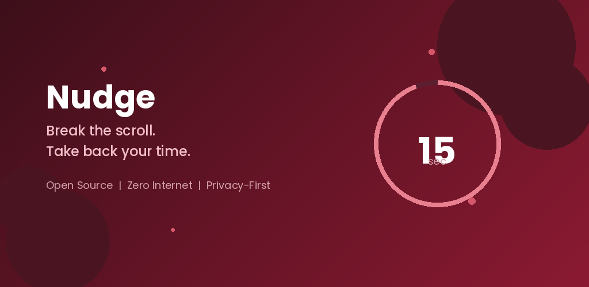
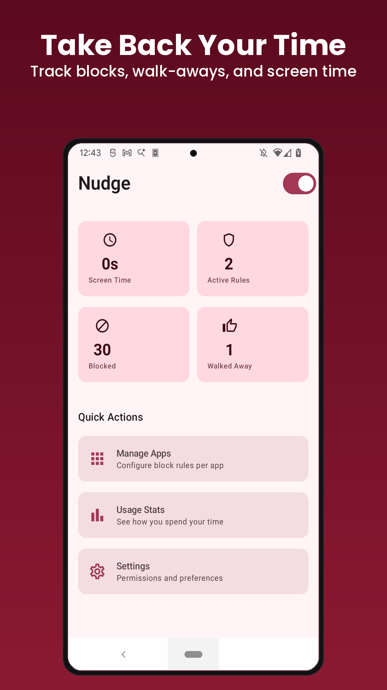
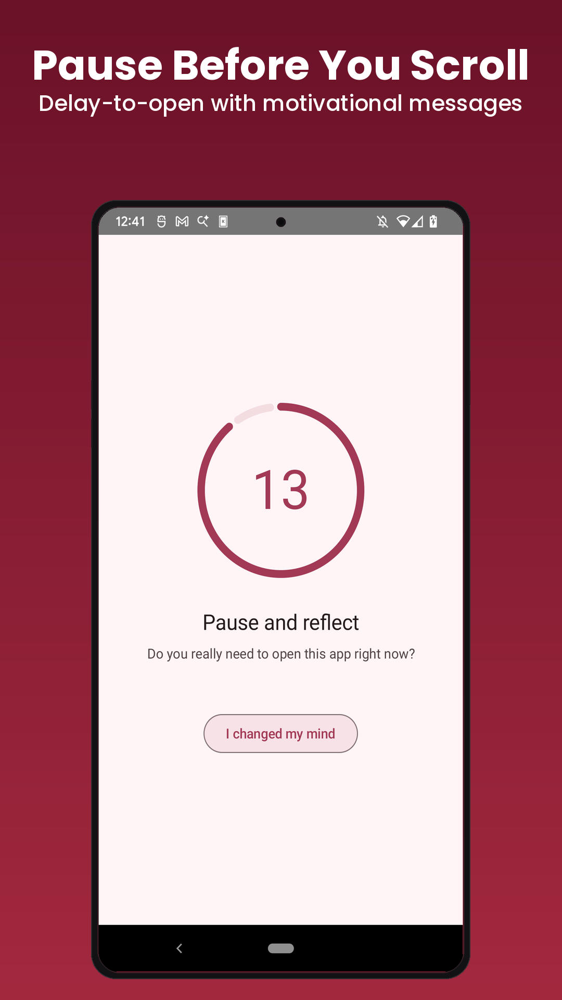
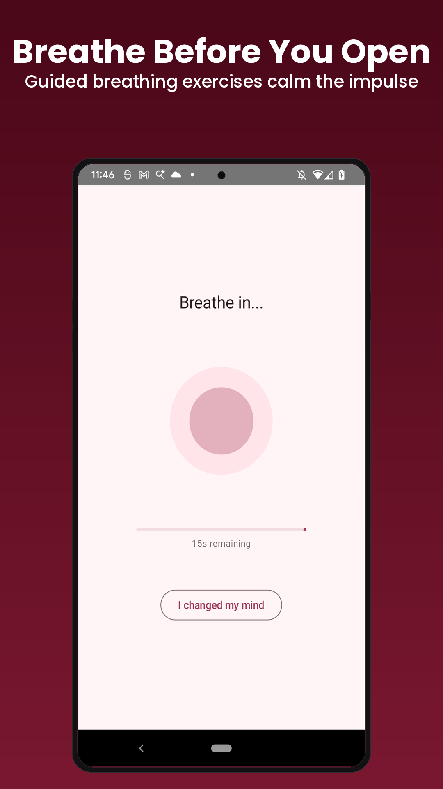
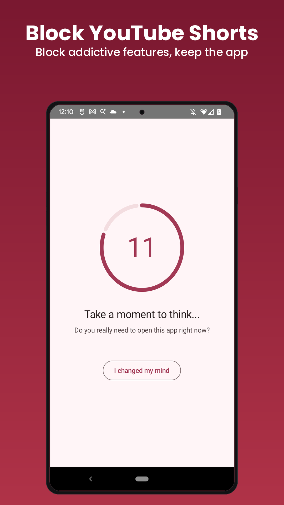
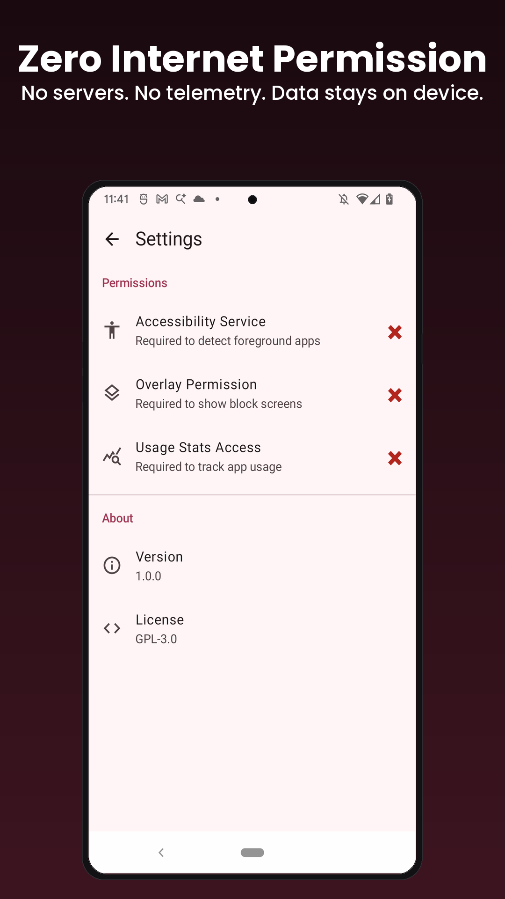

<p align="center">
  
</p>

<p align="center">
  <a href="https://github.com/astraedus/nudge/releases/latest"></a>
  <a href="LICENSE"></a>
  
  
</p>

<p align="center">
  <b>A privacy-first, open-source app blocker for Android.</b><br>
  Made by <a href="https://github.com/Antimatter543">@Antimatter543</a>. Always free.
</p>

---

<p align="center">
  
  
  
  
</p>

---

## Why

App blockers ask for Accessibility Service permissions, the most powerful permission on Android. It can see everything on your screen. Every keystroke, every notification, every app you open.

Most app blockers are closed-source. Some have been [acquired by data intelligence companies](https://sensortower.com/blog/actiondash-stayfree-acquisition-announcement). Their privacy policies are vague at best, alarming at worst. You're trusting a black box with root-level visibility into your digital life. I don't like that. I also **hate** spending money on apps that should be free.

Billions of dollars have been spent engineering the perfect attention trap. Every scroll, every notification, every autoplay video is designed to fragment your focus and keep you consuming. Instagram Reels, YouTube Shorts, TikTok are all retention machines built on decades of behavioral psychology research.

This app is the product of a disdain for subscription services for things that should be free, a disdain for all infinite scrolling short content and about 2 doses of ritalin.

Nudge is open source, requests zero internet permissions, and keeps all your data on your device. You can read every line of code. No analytics. No telemetry. No data leaving your phone. Ever. On principle.

## Features

### Core blocking

- **Delay-to-open** -- Before opening a blocked app, you wait through a breathing exercise or countdown timer. Not a hard lock -- a moment of friction that breaks the autopilot habit loop. This is the feature no other open-source blocker has.
- **Hard blocking** -- Completely block apps you don't want to access at all.
- **Daily time budgets** -- Allow 30 minutes of Instagram per day, then block. You choose the limit.
- **App groups** -- Create a "Social Media" group, configure once, apply to all.

### In-app feature blocking

Block addictive feeds without blocking the whole app:
- **YouTube Shorts** -- block the Shorts feed, keep everything else
- **Instagram Reels/Explore** -- block the infinite scroll, keep DMs and posts
- **TikTok For You** -- block the algorithm, keep the app

Uses Accessibility Service to detect in-app navigation to these screens.

### Smart features

- **Schedule rules** -- Block apps on specific days and times (e.g. block social media 9-5 on weekdays). Supports overnight schedules that span midnight.
- **Interaction counter** -- Floating overlay showing reels/shorts scrolled per session. Escalating colors warn you as the count rises.
- **Auto-kick** -- Automatically sends you home after N scrolls. Configurable threshold with cooldown.
- **Grayscale mode** -- Force your screen to grayscale to make apps less appealing.
- **Motivational messages** -- Rotating messages on overlay screens to reinforce your intent.
- **"Walked Away" tracking** -- Every time you choose to leave instead of waiting, Nudge counts it.
- **Export/Import** -- Back up your rules and share configurations.

### Dashboard

2x2 stats at a glance: **Screen Time**, **Active Rules**, **Blocked** (times blocked today), **Walked Away** (times you chose to leave). Weekly charts, hourly heatmaps, and streak tracking.

### Privacy

- **Zero internet permission** -- Declared in the manifest. Verifiable. Not a promise -- a guarantee.
- All data stored locally (Room DB + DataStore). Nothing leaves your device.
- No analytics, no telemetry, no crash reporting, no third-party SDKs.
- Open source under GPL-3.0. Read the [privacy policy](PRIVACY.md).

<p align="center">
  
</p>

## Install

### Download APK
Download the latest APK from [**Releases**](https://github.com/astraedus/nudge/releases) and sideload it.

### Build from source
```bash
git clone https://github.com/astraedus/nudge.git
cd nudge
export ANDROID_HOME=$HOME/Android/Sdk  # or your SDK path
./gradlew assembleDebug
# APK at app/build/outputs/apk/debug/app-debug.apk
adb install -r app/build/outputs/apk/debug/app-debug.apk
```

Requires: JDK 17+, Android SDK with platform 34 and build-tools 34.

## How the blocking works

```
AccessibilityService detects foreground app change
  -> BlockEngine evaluates rules for that app
  -> Decision: ALLOW | HARD_BLOCK | DELAY | BREATHING
  -> If blocked: full-screen overlay appears
  -> User can wait through the timer, or go back home
```

The delay/breathing modes are the core idea. They don't lock you out -- they insert a moment of intentional friction. Research shows this small pause is enough to break the automatic habit loop that drives most mindless phone usage.

## Permissions

Nudge requires three permissions. Here's exactly what each does and why:

| Permission | Why | What it sees |
|-----------|-----|-------------|
| **Accessibility Service** | Detects which app is in the foreground to trigger block rules | Package name of the foreground app. `canRetrieveWindowContent` is set to `false` -- Nudge cannot read your screen content. |
| **Display Over Other Apps** | Shows the block/delay overlay on top of blocked apps | Nothing. It's a display permission. |
| **Usage Stats** | Tracks your daily screen time per app for time budgets | App usage durations. Stored locally in a Room database on your device. |

No internet permission. No camera. No contacts. No location. No storage.

## Tech stack

- Kotlin + Jetpack Compose + Material 3
- Hilt (dependency injection), Room (local database), DataStore (preferences)
- Coroutines + Flow for reactive data
- Clean Architecture: `domain/` has zero Android imports -- fully unit-testable on JVM
- Min SDK 26 (Android 8.0), Target SDK 34

## Running tests

```bash
./gradlew test                    # Unit tests (JVM, no device needed)
./gradlew connectedAndroidTest    # Instrumented tests (needs connected device)
```

## Roadmap

- [x] App blocking (hard block, delay, breathing)
- [x] Per-app daily time budgets & app groups
- [x] In-app blocking (Reels, Shorts, Explore feeds)
- [x] Schedule-based rules (day-of-week + time-of-day)
- [x] Interaction counter & auto-kick
- [x] Usage stats dashboard with charts
- [x] Export/import rules
- [x] Grayscale mode
- [ ] QR code unlock (physical friction)
- [ ] NFC tag unlock
- [ ] Widget support

## Contributing

Issues and PRs welcome. If Instagram or YouTube changes their UI and breaks in-app detection rules, that's especially useful to report.

## License

[GPL-3.0](LICENSE). The code stays open. Fork it, improve it, share it.
